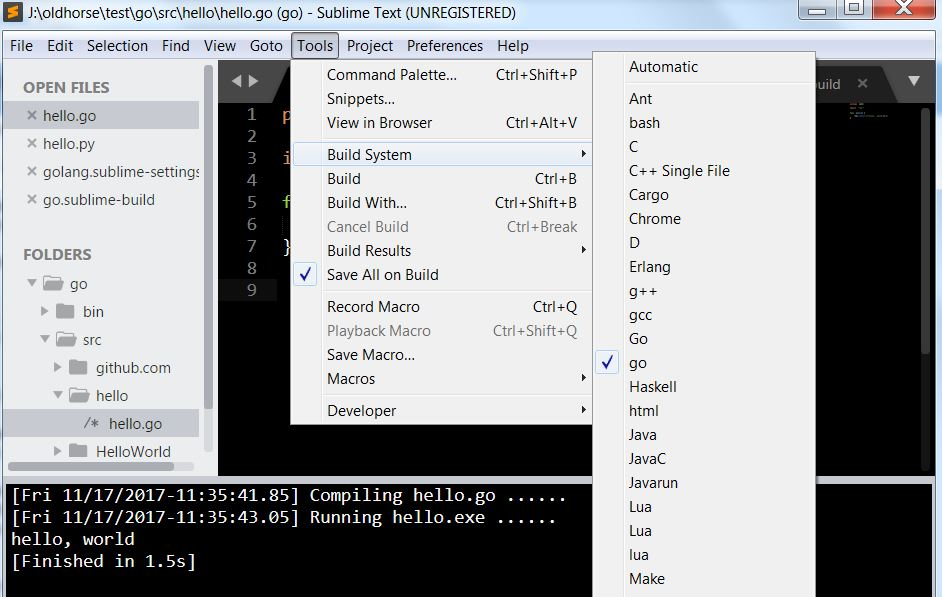
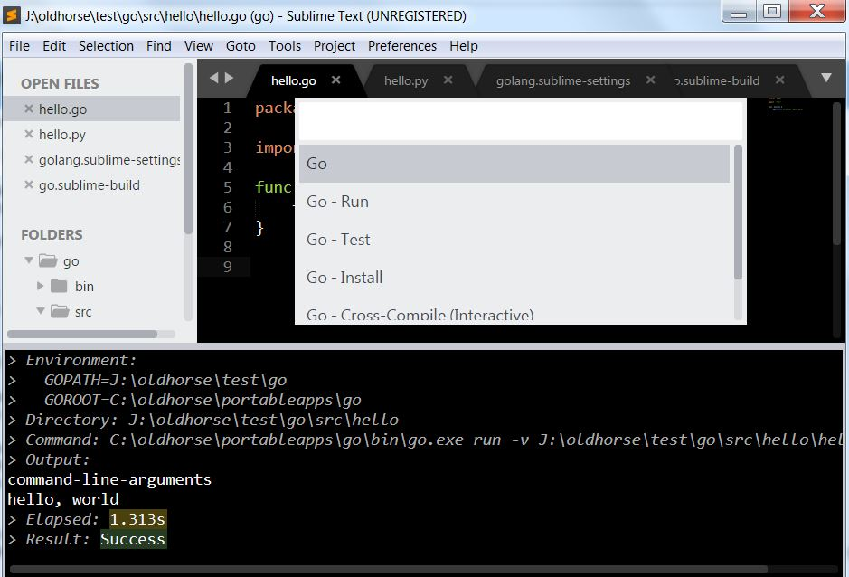

My portable sublime located at C:\oldhorse\portableapps\SublimeText3.

## solution1 batch job to handle build and run
This is my small script, no any plugin needed for simply test Go code.

First part is rungo.bat, handle build and run two steps.

```
C:\oldhorse\portableapps\SublimeText3\Data\Packages\User\rungo.bat

@ECHO OFF  
cd %~dp1  
ECHO [%DATE%TIME%] Compiling %~nx1 ...... 
IF EXIST %~n1.exe (  
DEL %~n1.exe
) 
set GOROOT=%~d0\oldhorse\portableapps\go
set PATH=%GOROOT%\bin;%PATH% 
go.exe build -o %~n1.exe %~nx1 
IF EXIST %~n1.exe (  
ECHO [%DATE%-%TIME%] Running %~n1.exe ......   
%~n1.exe  
)
```

then call it from go.sublime-build at C:\oldhorse\portableapps\SublimeText3\Data\Packages\User

```
go.sublime-build
{  
    "cmd": ["C:\\oldhorse\\portableapps\\SublimeText3\\Data\\Packages\\User\\rungo.bat", "$file"],  
    "file_regex": "^(...*?):([0-9]*):?([0-9]*)",  
    "selector": "source.go",  
    "encoding": "gbk"  
}
```

You can choice go from Tools-&gt;Build System list, this is for rungo.bat, then use Tools-&gt;Build to run script, result as below:

```
[Fri 11/17/2017-11:42:59.57] Compiling hello.go ...... 
[Fri 11/17/2017-11:43:00.82] Running hello.exe ......   
hello, world
[Finished in 1.5s]
```



## soluton2 - Official plugin from golang

Install plugin [golang/sublime-build](https://github.com/golang/sublime-build) from Sublime Package Control, search "Golang Build" then install it.

Click Preferences-&gt;Package Setting-&gt;Golang Config-&gt;Setting User, will open golang.sublime-settings, this is your chance to setup customized setting for Go.

You also see this file in C:\oldhorse\portableapps\SublimeText3\Data\Packages\User\golang.sublime-settings

```
{
    "GOROOT": "C:\\oldhorse\\portableapps\\go",
    "GOPATH": "J:\\oldhorse\\test\\go",
    "PATH": "J:\\oldhorse\\test\\go\\bin;C:\\oldhorse\\portableapps\\go\\bin"  
}
```

Then you can load Go code in Sublime and build/run it, keep in mind to organize Go project like below structure:

```
$GOPATH\go\bin
$GOPATH\go\src\hello\hello.go
```

You can choice Go from Tools-&gt;Build System list, this is for plugin sublime-build, and use Tools-&gt;Build With to choice task from submenu , result as below:

```
> Environment:
>   GOROOT=C:\oldhorse\portableapps\go
>   GOPATH=J:\oldhorse\test\go
> Directory: J:\oldhorse\test\go\src\hello
> Command: C:\oldhorse\portableapps\go\bin\go.exe run -v J:\oldhorse\test\go\src\hello\hello.go
> Output:
command-line-arguments
hello, world
> Elapsed: 1.067s
> Result: Success
```




